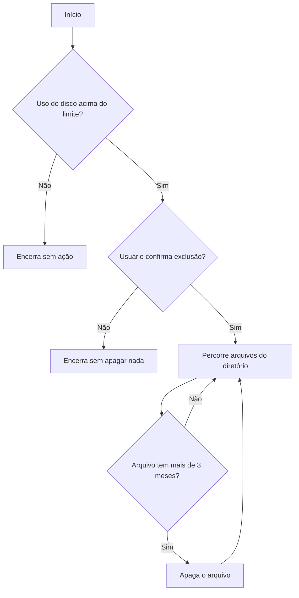

<div align="center">

# 🧹 Disk Usage Checker

### Script Python para monitorar uso de disco e limpar logs antigos, com confirmação manual


</div>

---

## 📋 Sumário

- [☁️ Sobre o projeto](#️-sobre-o-projeto)
- [⚙️ Como funciona](#️-como-funciona)
- [🧰 Pré-requisitos](#-pré-requisitos)
- [▶️ Como usar](#️-como-usar)
- [🐛 Bugs encontrados e corrigidos](#-bugs-encontrados-e-corrigidos)
- [⚠️ Avisos de segurança](#️-avisos-de-segurança)
- [🛰️ Próximos passos](#️-próximos-passos)

---

## ☁️ Sobre o projeto

Script escrito do zero em Python, sem depender de bibliotecas externas (só `os`, `shutil` e `time`, da biblioteca padrão). Ele verifica quanto de um disco está em uso e, se ultrapassar um limite configurável, pergunta ao usuário se quer apagar arquivos com mais de 3 meses dentro de um diretório de logs.

> 🖥️ **Ambiente de desenvolvimento:** Arch Linux, VS Code, Python 3.14

---

## ⚙️ Como funciona



---

## 🧰 Pré-requisitos

- ✅ Python 3.x instalado (usa só biblioteca padrão, nada pra instalar via pip)
- ✅ Permissão de leitura/escrita no diretório configurado em `path_logs`

---

## ▶️ Como usar

```bash
python payload.py
```

O script vai:
1. Calcular o percentual de uso do disco no caminho definido em `path_logs`
2. Se estiver acima do limite (`limit_use`, padrão 75%), avisar e perguntar se deve apagar logs antigos
3. Se confirmado, apagar arquivos com data de modificação superior a 3 meses

> 💡 Pra ajustar o limite de uso ou o caminho monitorado, edita as variáveis `limit_use` e `path_logs` no topo do arquivo.

---

## 🐛 Bugs encontrados e corrigidos

<details>
<summary><strong>1. 📁 Path incorreto: /var/logs em vez de /var/log</strong></summary>

**Sintoma:** `FileNotFoundError: [Errno 2] No such file or directory: '/var/logs'`

**Causa:** o diretório padrão de logs em qualquer distro Linux é `/var/log`, sem "s" no final. O nome errado (com "s") não existe no sistema de arquivos.

**Fix:** `path_logs = "/var/log"`
</details>

<details>
<summary><strong>2. 🔇 Script rodava sem erro e não fazia nada</strong></summary>

**Sintoma:** o script executava e devolvia o prompt na hora, sem nenhum print.

**Causa:** a função `check_disk_usage()` era definida, mas nunca chamada em lugar nenhum do arquivo.

**Fix:** adicionado ao final do arquivo:
```python
if __name__ == "__main__":
    check_disk_usage()
```

Esse padrão garante que a função só executa quando o arquivo é rodado diretamente, e não quando é importado como módulo em outro script.
</details>

---

## ⚠️ Avisos de segurança

- 🔒 **`/var/log` normalmente exige privilégio elevado** para deletar arquivos dentro dele. Rodar com `sudo` pode ser necessário, mas nunca em ambiente de produção sem antes validar em um ambiente descartável (VM ou container).
- 🕐 O critério de "3 meses" (`time.time() - 7776000`) é fixo no código. Antes de rodar em qualquer lugar real, vale conferir se esse é de fato o período correto para o seu caso de uso.
- ✅ O script sempre pede confirmação manual (`input`) antes de apagar qualquer coisa, não há exclusão automática silenciosa.

---

## 🛰️ Próximos passos

- [ ] Adicionar modo `--dry-run` (lista o que seria apagado, sem apagar de fato)
- [ ] Tornar o limite de idade dos arquivos configurável via argumento de linha de comando
- [ ] Adicionar logging da própria execução do script (o que foi verificado, o que foi apagado)

---

<div align="center">

Feito com 🐍 e muito debug

</div>
